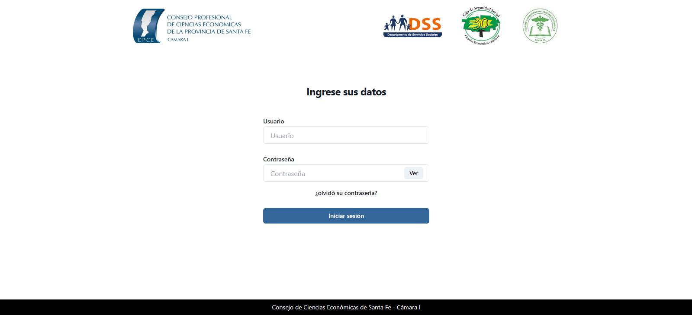
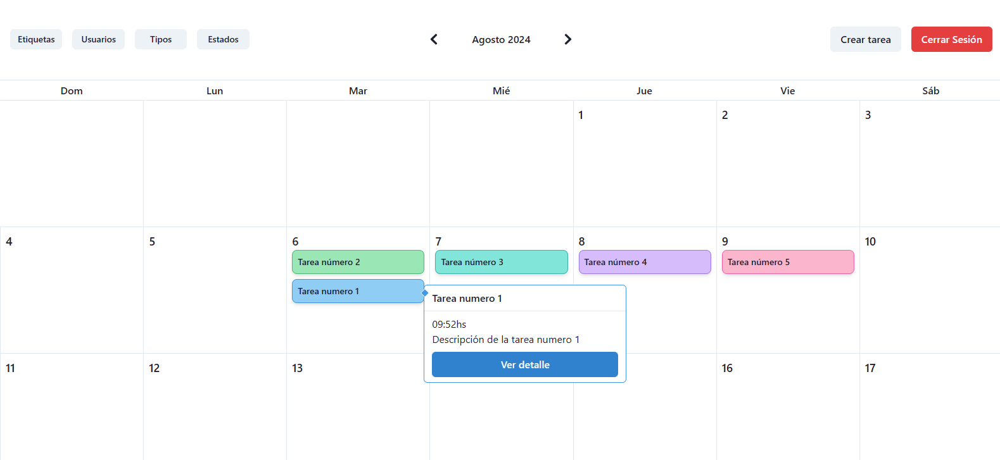
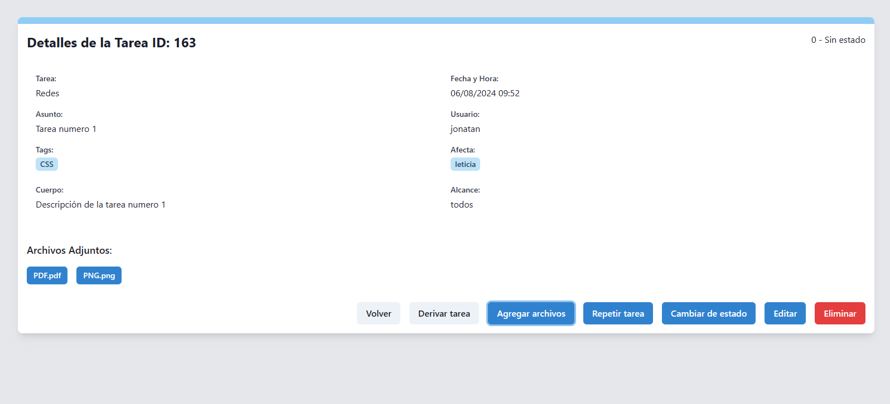

## Proyecto: Calendario de Gestión de Tareas

### Descripción del Proyecto
Se implementó un calendario para gestionar tareas a lo largo del tiempo en el sector de comunicación del Consejo de Ciencias Económicas. El calendario incluye las siguientes funciones avanzadas:

- **Inicio de Sesión**: Autenticación segura para acceder al calendario.
- **Drag and Drop**: Permite mover y reorganizar tareas mediante arrastrar y soltar.
- **Historial de Tareas**: Registro completo de todas las actividades y cambios realizados en las tareas.
- **Derivación**: Capacidad para asignar tareas a diferentes responsables según las necesidades.
- **Asignación de Estados**: Etiquetado de tareas con estados como "pendiente", "en progreso" y "completada".
- **Control de Tamaño de Archivos**: Restricción y validación del tamaño de los archivos adjuntos.
- **Subida de Archivos**: Funcionalidad para adjuntar archivos relevantes a cada tarea.
- **Edición y Descarga de Archivos**: Capacidad para modificar detalles de las tareas y descargar archivos adjuntos.

### Imágenes

- **Inicio de Sesión**
  

- **Vista Home (Calendario de Tareas)**
  

- **Vista Detalle de Tarea**
  

